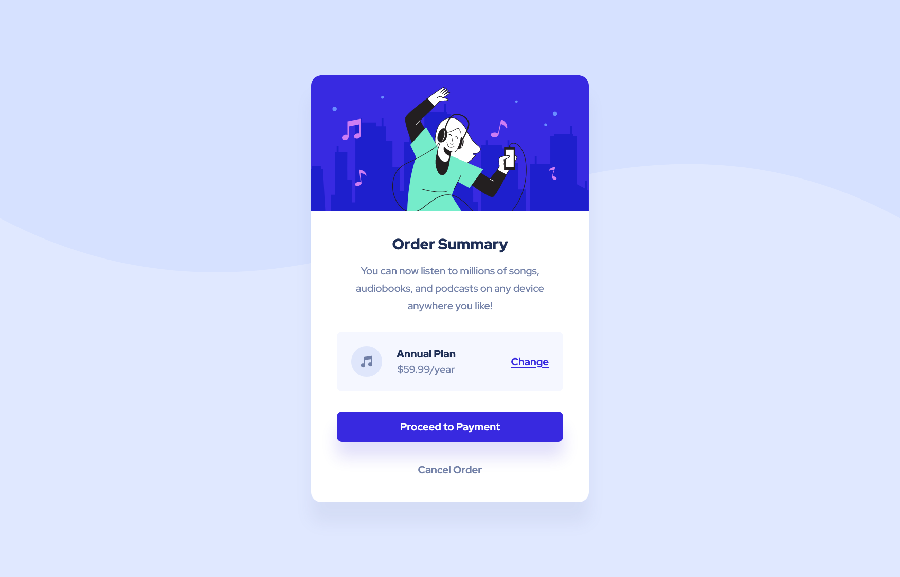

# Frontend Mentor - Order summary card solution

Hello fellas, this is a solution to the [Order summary card challenge on Frontend Mentor](https://www.frontendmentor.io/challenges/order-summary-component-QlPmajDUj). Frontend Mentor challenges help you improve your coding skills by building realistic projects. 

## Table of contents

- [The challenge](#the-challenge)
- [Screenshot](#screenshot)
- [Links](#links)
- [Useful resources](#useful-resources)
- [Author](#author)

## The challenge

Users should be able to:

- See hover states for interactive elements

## Screenshot

## Links

- Solution URL: [GitHub repository](https://github.com/joangute/mentor-solution_order-summary-component/)
- Live Site URL: [GitHub Pages](https://joangute.github.io/mentor-solution_order-summary-component/)

## Useful resources

- [Type Scale](https://type-scale.com/) - This helped me get the H1 size from my base font size of 16px.

## Author

- Frontend Mentor - [@joangute](https://www.frontendmentor.io/profile/joangute)